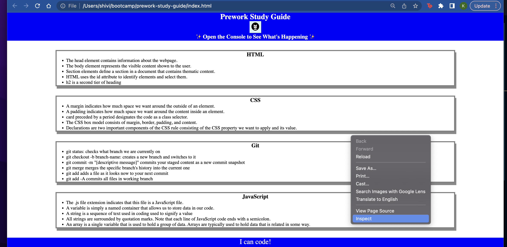

# <Your-Project-Title>

## Description

This Prework Study Guide was created for boot camp students as a segue to the topics covered throughout the course. It was built to help students grasp new concepts in a digestible manner by dviding information into each section that apply a broad, surface level depiction of the coding languages HTML, JavaScript, and CSS.

## Installation

N/A

## Usage

To use this Study Guide, you can review the notes on the sections CSS, JavaScript, Git, and HTML for helpful tips and information. Information such as JavaScript functions, loops, and debugging can be found through opening Chrome DevTools by pressing Command+Option+I on Mac and Control+Shift+I on Windows (or simply right click, inspect). This will open a console panel providing information and materials discussed throughout the pre work as well as which topics to cover first. 

## Credits

N/A

## License

MIT licensing with permisions such as commercial use, modification, distribution and private use. Limitations include liability and warranty. 

